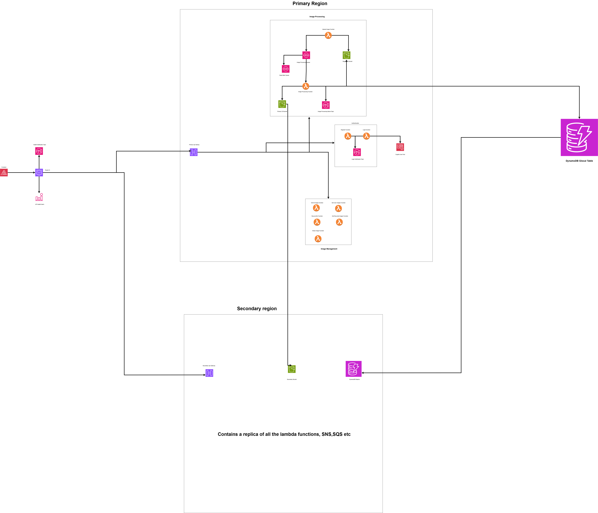

# PhotoBlogApp

A serverless photo blog application built with AWS services that allows users to upload, share, and manage images with a recycle bin feature. The application is designed with multi-region deployment capabilities for high availability and disaster recovery.



## Overview

PhotoBlogApp is a cloud-native application that provides a secure platform for users to store and share their photos. It leverages AWS serverless technologies to provide a scalable, cost-effective solution with built-in disaster recovery capabilities.

## Features

- **User Authentication**: Secure user registration and login using Amazon Cognito
- **Image Upload**: Upload images to the cloud with metadata
- **Image Processing**: Automatic processing of uploaded images
- **Image Sharing**: Generate shareable links for images
- **Recycle Bin**: Soft delete with ability to restore images
- **Multi-region Deployment**: High availability across multiple AWS regions
- **Disaster Recovery**: Automatic failover between regions

## Architecture

The application is built using a serverless architecture with the following AWS services:

- **Amazon Cognito**: User authentication and management
- **AWS Lambda**: Serverless compute for all application logic
- **Amazon API Gateway**: RESTful API endpoints
- **Amazon S3**: Storage for images (staging, primary, and secondary buckets)
- **Amazon DynamoDB**: NoSQL database for image metadata with global tables for multi-region replication
- **Amazon SQS**: Message queuing for image processing
- **Amazon SNS**: Notifications for login events and processing failures
- **AWS CloudFormation**: Infrastructure as Code for deployment
- **Amazon Route53**: DNS management and health checks for failover

## Technology Stack

- **Backend**: Java 17, AWS Lambda, API Gateway
- **Authentication**: Amazon Cognito
- **Storage**: Amazon S3, Amazon DynamoDB
- **Messaging**: Amazon SQS, Amazon SNS
- **Infrastructure**: AWS SAM, CloudFormation
- **Build Tools**: Maven, AWS SAM CLI

## Prerequisites

To deploy and run this application, you need:

* AWS Account with appropriate permissions
* SAM CLI - [Install the SAM CLI](https://docs.aws.amazon.com/serverless-application-model/latest/developerguide/serverless-sam-cli-install.html)
* Java 17 - [Install the Java Development Kit 17](https://www.oracle.com/java/technologies/javase/jdk17-archive-downloads.html)
* Maven - [Install Maven](https://maven.apache.org/install.html)
* Docker - [Install Docker community edition](https://hub.docker.com/search/?type=edition&offering=community)

## Deployment

The application is designed to be deployed to two AWS regions for high availability:
- Primary region: eu-west-1 (Ireland)
- Secondary region: eu-central-1 (Frankfurt)

### Deploy to Primary Region

```bash
# Build the application
sam build

# Deploy to primary region
sam deploy --guided --parameter-overrides Environment=primary
```

### Deploy to Secondary Region

```bash
# Deploy to secondary region
sam deploy --guided --parameter-overrides Environment=secondary --stack-name PhotoBlogApp-Secondary --region eu-central-1
```

During the guided deployment, you'll be prompted for:

* **Stack Name**: Use "PhotoBlogApp" for primary and "PhotoBlogApp-Secondary" for secondary
* **AWS Region**: Use eu-west-1 for primary and eu-central-1 for secondary
* **HostedZoneId**: Your Route53 hosted zone ID for DNS configuration
* **Confirm changes before deploy**: Recommended to set to yes
* **Allow SAM CLI IAM role creation**: Must be set to yes
* **Save arguments to samconfig.toml**: Set to yes to save configuration

After deployment, you can find your API Gateway Endpoint URL in the output values displayed.

## API Endpoints

The application exposes the following API endpoints:

### Authentication Endpoints

| Endpoint | Method | Description | Authentication |
|----------|--------|-------------|----------------|
| `/register` | POST | Register a new user | None |
| `/login` | POST | Login and get authentication token | None |

### Image Management Endpoints

| Endpoint | Method | Description | Authentication |
|----------|--------|-------------|----------------|
| `/image/upload` | POST | Upload a new image | Required |
| `/images` | GET | Get all public images | Required |
| `/images/user` | GET | Get all images for current user | Required |
| `/image/{imageId}/share` | GET | Generate a shareable link for an image | Required |
| `/images/{imageId}/recycle` | DELETE | Move image to recycle bin | Required |
| `/images/{imageId}/restore` | PUT | Restore image from recycle bin | Required |
| `/images/{imageId}/permanent-delete` | DELETE | Permanently delete an image | Required |
| `/images/recycled` | GET | Get all recycled images for current user | Required |

### System Endpoints

| Endpoint | Method | Description | Authentication |
|----------|--------|-------------|----------------|
| `/health` | GET | Health check endpoint | None |

## Local Testing

Build the application with the `sam build` command:

```bash
sam build
```

The SAM CLI installs dependencies defined in `PhotoBlogAppApi/pom.xml`, creates a deployment package, and saves it in the `.aws-sam/build` folder.

### Test Individual Functions

Test a single function by invoking it directly with a test event:

```bash
# Test the health check function
sam local invoke HealthCheckFunction --event events/event.json

# Test the login function
sam local invoke LoginUserHandlerFunction --event events/event.json
```

### Test the API Locally

Run the API locally on port 3000:

```bash
sam local start-api
```

Example API calls:

```bash
# Health check
curl http://localhost:3000/health

# Register a user (replace with your details)
curl -X POST http://localhost:3000/register \
  -H "Content-Type: application/json" \
  -d '{"email":"user@example.com","password":"Password123!","firstName":"John","lastName":"Doe"}'

# Login
curl -X POST http://localhost:3000/login \
  -H "Content-Type: application/json" \
  -d '{"email":"user@example.com","password":"Password123!"}'
```

## Disaster Recovery Features

PhotoBlogApp is designed with disaster recovery in mind:

1. **Multi-Region Deployment**: The application can be deployed to multiple AWS regions.
2. **Data Replication**:
   - S3 buckets are configured with cross-region replication
   - DynamoDB tables use global tables for multi-region replication
3. **Automatic Failover**:
   - Route53 health checks monitor the primary region
   - Automatic DNS failover to the secondary region if the primary region is unavailable
4. **Stateless Architecture**:
   - Lambda functions are stateless, allowing requests to be processed in any region

## Monitoring and Troubleshooting

### CloudWatch Logs

To view logs for a specific Lambda function:

```bash
# View logs for the image upload function
sam logs -n ImageUploadFunction --stack-name PhotoBlogApp --tail

# View logs for the login function
sam logs -n LoginUserHandlerFunction --stack-name PhotoBlogApp --tail
```

### Health Checks

The application includes a health check endpoint that can be used to verify the status of the API:

```bash
curl https://{api-id}.execute-api.{region}.amazonaws.com/Prod/health
```

## Security

The application implements several security features:

1. **User Authentication**: Amazon Cognito handles user registration and authentication
2. **API Authorization**: API Gateway endpoints are protected with Cognito authorizers
3. **Secure Token Handling**: JWT tokens are used for authentication
4. **CORS Configuration**: API Gateway is configured with appropriate CORS headers

## Cleanup

To delete the application, use the AWS CLI to delete both the primary and secondary stacks:

```bash
# Delete primary stack
aws cloudformation delete-stack --stack-name PhotoBlogApp --region eu-west-1

# Delete secondary stack
aws cloudformation delete-stack --stack-name PhotoBlogApp-Secondary --region eu-central-1
```

## Contributing

Contributions to the PhotoBlogApp are welcome! Please follow these steps:

1. Fork the repository
2. Create a feature branch (`git checkout -b feature/amazing-feature`)
3. Commit your changes (`git commit -m 'Add some amazing feature'`)
4. Push to the branch (`git push origin feature/amazing-feature`)
5. Open a Pull Request

## License

This project is licensed under the MIT License - see the LICENSE file for details.

## Resources

- [AWS SAM Documentation](https://docs.aws.amazon.com/serverless-application-model/latest/developerguide/what-is-sam.html)
- [AWS Lambda Documentation](https://docs.aws.amazon.com/lambda/latest/dg/welcome.html)
- [Amazon Cognito Documentation](https://docs.aws.amazon.com/cognito/latest/developerguide/what-is-amazon-cognito.html)
- [Amazon S3 Documentation](https://docs.aws.amazon.com/AmazonS3/latest/userguide/Welcome.html)
- [Amazon DynamoDB Documentation](https://docs.aws.amazon.com/amazondynamodb/latest/developerguide/Introduction.html)
